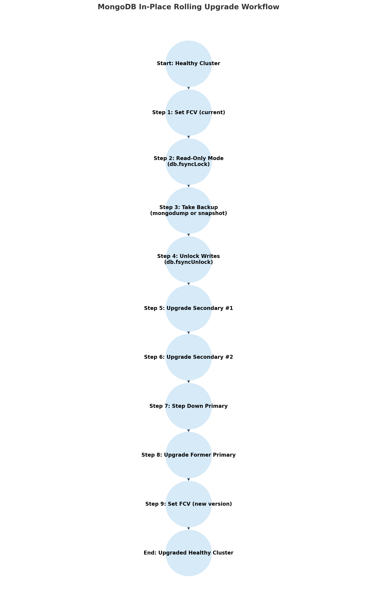

# 🔄 Major Approaches to MongoDB Major Version Upgrades
There are several approaches to perform a MongoDB major version upgrade, depending on your environment (replica set, sharded cluster, standalone) and your tolerance for downtime. Each has tradeoffs in risk, downtime, and complexity.


## 1. **In-Place Rolling Upgrade (Recommended for HA Clusters)**

Upgrade one node at a time while the cluster stays online.

**How it works:**

* Stop a **secondary** node, upgrade binaries, restart, validate.
* Repeat for all secondaries.
* Step down the **primary** and upgrade it last.
* For sharded clusters: upgrade config servers → shard replica sets → mongos routers.

**Pros:**

* Zero/minimal downtime (if replica set/quorum maintained).
* Supported directly by MongoDB documentation.
* No extra infrastructure needed.

**Cons:**

* Slower overall process (many steps).
* Risk of version skew if a node misbehaves.
* Doesn’t allow skipping multiple major versions.

**Best for:**
Production replica sets & sharded clusters where uptime is critical.

---

## 2. **In-Place Standalone Upgrade (For Non-Clustered Instances)**

Stop the instance, upgrade binaries, restart.

**How it works:**

* Shut down `mongod`.
* Replace binaries with new version.
* Restart and set new Feature Compatibility Version (FCV).

**Pros:**

* Simple.
* Quick for small test or dev environments.

**Cons:**

* Full downtime during upgrade.
* No fallback without backups/snapshots.

**Best for:**
Development environments or low-criticality systems.

---

## 3. **Blue-Green / Parallel Cluster Upgrade**

Run old and new clusters side by side, cut over once validated.

**How it works:**

* Build a new cluster with the target MongoDB version.
* Sync data via replication.
* Point applications to the new cluster once validated.

**Pros:**

* Safe rollback (just switch traffic back).
* Lets you test workloads on the new version ahead of cutover.

**Cons:**

* Requires double infrastructure temporarily.
* Data sync can be tricky for large datasets.
* Cutover might involve downtime unless dual writes are implemented.

**Best for:**
Large enterprises or risk-averse teams needing a tested fallback.

---

## 4. **Logical Backup & Restore Upgrade**

Export/import data between versions.

**How it works:**

* Use `mongodump` from old version.
* Install new binaries.
* Use `mongorestore` into new version.

**Pros:**

* Works across big version gaps (with care).
* Cleans up old metadata/index issues.

**Cons:**

* Full downtime during dump/restore.
* Not practical for large datasets.
* Risk of data inconsistency if not carefully quiesced.

**Best for:**
Small datasets, test migrations, dev environments.

---

## ✅ Key Decision Factors

* **Downtime tolerance**: If downtime is unacceptable → choose *rolling upgrade* or *blue-green*.
* **Dataset size**: Logical dump/restore doesn’t scale for large data.
* **Infrastructure**: If you can provision duplicate clusters → blue-green is safest.


# 🔄 Manual Upgrade Journey: In-Place Rolling Upgrade (HA Replica Set)

We’ll walk through upgrading a **replica set cluster** across a major MongoDB version, while keeping the service online.

The high-level steps are:
1. Confirm health & FCV.
2. Put cluster read-only → backup → unlock writes.
3. Upgrade secondaries (one at a time).
4. Step down primary → upgrade it.
5. Set FCV to new version.
6. Validate & test.



---

## 1. Preparation

1. **Confirm supported upgrade path**

   * MongoDB only supports upgrading **one major version at a time** (e.g., 4.2 → 4.4, not 4.2 → 5.0).

2. **Check cluster health**

   ```javascript
   rs.status()
   db.adminCommand({ serverStatus: 1 })
   ```

   * Ensure all members are `PRIMARY` or `SECONDARY`.
   * No replication lag.

3. **Check Feature Compatibility Version (FCV)**

   ```javascript
   db.adminCommand({ getParameter: 1, featureCompatibilityVersion: 1 })
   ```

   * Must be set to the **current version** before upgrading binaries.
   * If not:

     ```javascript
     db.adminCommand({ setFeatureCompatibilityVersion: "X.Y" }) // e.g., "6.0"
     ```

---

## 2. Backup (Cluster Read-Only)

To guarantee a consistent snapshot:

1. **Put the cluster in read-only mode**

   * Connect to the **PRIMARY** and enter:

     ```javascript
     db.fsyncLock()
     ```

     This flushes data to disk and blocks writes.

   * ⚠️ Reads are still possible, but **all writes are blocked** until unlocked.

2. **Take a backup**

   * Options:

     * **Logical backup:**

       ```bash
       mongodump --host <primaryHost> --out /backups/upgrade-<date>
       ```
     * **Filesystem snapshot:**

       * Take a snapshot at the storage layer (LVM, EBS, SAN, etc.).

3. **Unlock writes**

   ```javascript
   db.fsyncUnlock()
   ```

✅ Now you have a consistent backup before the upgrade begins.

---

## 3. Rolling Upgrade (Node by Node)

### Step A: Upgrade a Secondary

1. Pick a **SECONDARY** node.
2. Stop the `mongod` process.

   ```bash
   sudo systemctl stop mongod
   ```
3. Upgrade binaries (replace old MongoDB packages with new ones).

   * Example (Ubuntu):

     ```bash
     sudo apt-get update
     sudo apt-get install -y mongodb-org=<newVersion>
     ```
4. Restart `mongod`:

   ```bash
   sudo systemctl start mongod
   ```
5. Validate:

   * Ensure it rejoins replica set (`rs.status()`).
   * Check logs for errors.
   * Run a basic read query.

---

### Step B: Repeat for All Secondaries

* One by one, upgrade each **remaining SECONDARY** node.
* Always validate before moving on.

---

### Step C: Upgrade the Primary

1. **Step down the Primary** (forces election):

   ```javascript
   rs.stepDown()
   ```

   * A healthy SECONDARY becomes PRIMARY.

2. Upgrade the old primary (now a secondary) using the same steps:

   * Stop `mongod`.
   * Upgrade binaries.
   * Restart and validate.

---

## 4. Post-Upgrade Steps

1. **Verify all nodes are on new version**

   ```javascript
   db.version()
   ```

2. **Re-enable feature compatibility for new version**

   ```javascript
   db.adminCommand({ setFeatureCompatibilityVersion: "<newVersion>" }) 
   ```

   * Example:

     ```javascript
     db.adminCommand({ setFeatureCompatibilityVersion: "7.0" })
     ```

3. **Monitor cluster health**

   ```javascript
   rs.status()
   db.serverStatus()
   ```

4. **Test application workload**

   * Run smoke tests from your app against the upgraded cluster before putting the application live.


---

# ⚠️ Challenges of the In-Place Rolling Upgrade Process

## 1. Backup and Read-Only Window

* **Challenge:** Putting the cluster into `fsyncLock` mode for backups blocks all writes, which can impact applications even if just for a few minutes.
* **Impact:** Requires coordination with application teams to avoid failed writes.
* **Mitigation:** Use snapshots or hidden secondaries for backups where possible, to reduce primary disruption.

---

## 2. Replication Lag

* **Challenge:** Upgraded nodes may take longer to resync due to oplog changes, larger workloads, or resource overhead.
* **Impact:** Prolonged lag increases rollback risk if a failover occurs.
* **Mitigation:** Monitor replication lag carefully with **`rs.printSecondaryReplicationInfo()`** before moving to the next node.

---

## 4. Feature Compatibility Version (FCV) Management

* **Challenge:** Forgetting to set FCV properly before or after the upgrade can block new features or cause unexpected behavior.
* **Impact:** Application queries may fail silently, or new features appear disabled.
* **Mitigation:** Explicitly check and document FCV settings before/after the upgrade.

---

## 5. Version Skew Risks

* **Challenge:** For part of the process, some nodes run on the old version and others on the new.
* **Impact:** Certain operations (e.g., new aggregation stages, schema validation features) can behave inconsistently across nodes.
* **Mitigation:** Avoid schema migrations or application feature changes until all nodes are fully upgraded.

---

## 6. Driver and Application Compatibility

* **Challenge:** Even if the server upgrade is smooth, old drivers may not recognize new wire protocol states or features.
* **Impact:** Clients may throw unexpected connection errors (e.g., *“unknown topology”*).
* **Mitigation:** Upgrade drivers **before** or alongside the server upgrade. Validate in staging with your application workload.

---

## 7. Resource Spikes

* **Challenge:** Restarting `mongod` can trigger cache warm-ups, index rebuilds (if necessary), and increased replication traffic.
* **Impact:** Applications may experience slower query response times temporarily.
* **Mitigation:** Upgrade nodes one at a time during off-peak hours. Monitor CPU, memory, and disk I/O closely.

---

## 8. Human Error and Manual Complexity

* **Challenge:** The process involves many manual steps — step downs, restarts, version checks, FCV updates.
* **Impact:** Missing a single command (e.g., forgetting `rs.stepDown()`) can cause unplanned downtime.
* **Mitigation:** Use a **documented runbook** or automation tooling (Ansible, Ops Manager, Kubernetes Operators).

---

## 9. Rollback Difficulty

* **Challenge:** If something goes wrong after a few nodes are upgraded, rolling back requires reinstalling old binaries and restoring from backups.
* **Impact:** Rollback may take hours and introduce downtime.
* **Mitigation:** Validate after each node upgrade before proceeding. Keep backups tested and accessible.

---

# ✅ Key Takeaw

For very large, business-critical databases, a backup alone can consume hours—sometimes longer—making it nearly impossible to fit the full upgrade into a reasonable maintenance window. Because of this, some teams are tempted to skip the backup step entirely, running the upgrade without a guaranteed way to recover if something goes wrong. 
While that shortcut might be tolerable in a development or test environment, where data loss is inconvenient but not disastrous, it’s completely unacceptable in production. For mission-critical systems, upgrading without a recovery option is a high-risk gamble that can lead to irreversible data loss and prolonged downtime.


## IBM Cloud Database in-place Major version upgrades
Now, let’s shift the perspective to IBM Cloud Databases in place Major version upgrades. Instead of juggling commands and hoping for the best, the upgrade becomes a safe, predictable process designed with recovery in mind. IBM Cloud’s first priority is ensuring your data is never at risk. Before the upgrade even begins, your instance is placed into read-only mode, ensuring no new changes slip through the cracks. Then a recovery point is ensured, guaranteeing that you can always roll back to a known-good state.

Only after these safety measures are in place does IBM Cloud proceed with the upgrade itself. Behind the scenes, it runs all the steps you’d normally have to manage by hand: validating compatibility, switching binaries, changing FCV and verifying system health. Once complete, the system is switched back to be writable.

The difference is profound. In the manual world, you’re balancing a dozen moving pieces with the constant risk of downtime or data loss. With IBM Cloud Databases in-place Major version upgrades, the process is automated, reliable, and—most importantly—recoverable at every step. You don’t have to trust your luck; you can trust the platform.

In IBM Cloud Databases for MongoDB, performing an in-place major version upgrade is designed to be straightforward and flexible, no matter how you interact with the service. You can trigger the upgrade directly from the IBM Cloud Console with just a few clicks, use the CLI if you prefer command-line workflows, call the API for automation, or manage it declaratively through Terraform. In Terraform, it’s literally as simple as updating the version attribute in your ibm_database resource definition—Terraform will handle the orchestration behind the scenes. This consistency across interfaces means teams can choose the workflow that best fits their operations, whether that’s manual management through the UI or fully automated infrastructure-as-code pipelines.

⇨ [Let's upgrade your database...](20-seamless-upgrades.md)
