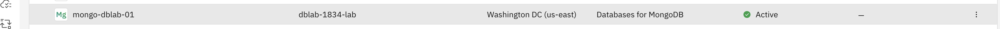

# Upgrading your database

## What you will accomplish
By the end of this lab, you'll understand:

- How IBM Cloud Databases can ease your upgrade journey from one major database version to another
- You'll understand the different steps that are performed under the cover
- You'll have successfully upgraded a PostgreSQL instance to a new major version

## Log in to IBM Cloud

1. Go to <https://ibm.biz/1834-invite>
1. Enter the `Username` and `Password` provided for the lab.
1. Click **Sign in**.

## Step 1: Find your Mongo Instance

1. Navigate to the [IBM Cloud Resource overview](https://cloud.ibm.com/resources)
2. Select the instance that is suffixed with your lab user e.g. `mongo-dblab-01` for `dblab-01`
    
3. View the instance details and validate that the version is shown as _6.0 (deprecated)_
    
4. Select _backup and restore_ on the right side and validate the list of backups for the instance is not empty

## Step 2: Upgrade to Mongo 7 and take a backup

1. Select upgrade major version next to the current major version on the deployment details
2. Review the guidance dialog on the right side
     
3. Confirm that you're ready to proceed and press next
     
5. Leave the default expiration selected
6. Proceed to trigger the update

**Note:** Certain operations like upgrades of backups of your database instance require exclusive access and can not happen at the same time. Depending on the size of your database a backup itself can take a certain amount of time. Expiration allows you express that an upgade should be started within X minutes, or not at all. This allows you to ensure a backup with complete within a specific amount of time and is not bleeding beyond the application maintenance window your have allocated for the application

## Step 3: Validate the upgrade

IBM Cloud Database platform will now execute all necessary steps as outlined in [upgrade steps](10-upgrades.md). The instance will be made read only for the duration of the upgrade, applications can still read, but writes are blocked.

1. When the upgrade is finished, select _backup and restore_ on the right side and validate a new backup has been added to the list
     

Congratulations, you've successfully upgraded the instance to MongoDB 7.0. We'll now perform another upgrade to Mongo 8.0 without taking a backup, so you get to know both methods the platform supports.

## Step 4: Upgrade to Mongo 8 without taking a backup

1. Select upgrade major version next to the current major version on the deployment details
2. Review the guidance dialog on the right side
3. Confirm that you're ready to proceed and press next
4. Uncheck "Take an automatic Backup before upgrading"
5. Leave the default expiration selected
6. Proceed to trigger the update

## Step 5: Validate the upgrade

Similar as during the first upgrade, select _backup and restore_ on the right side and validate a new backup has been added to the list.

⇨ [Let's review what we learned...](50-success.md)

